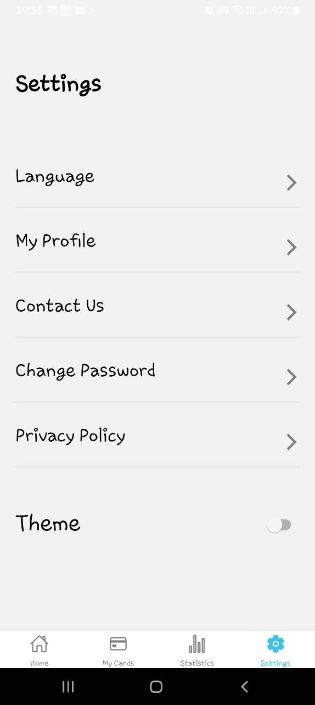

# RN Assignment 5

## Description

This React Native application demonstrates a simple app with Home and Settings screens, theme switching between light and dark modes, and custom components for a consistent UI design.

## Screenshots




## How to Run

1. Clone the repository:
   ```bash
   git clone https://github.com/<your-username>/rn-assignment5-<YourID>.git


2. Install dependencies:
cd rnAssignment5
npm install


3. Run the app:
npx react-native run-android
npx react-native run-ios


